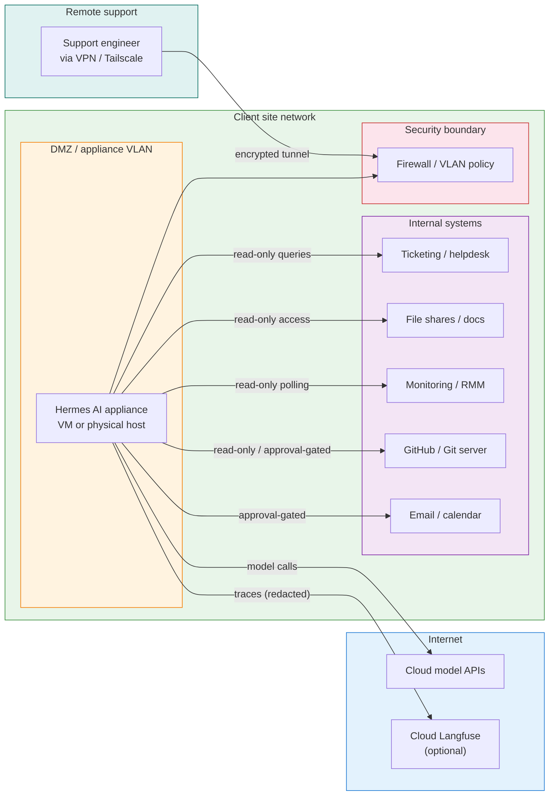

# Client appliance network and data-flow diagram

## Purpose

This diagram shows how a client appliance deployment is typically placed on a client network, what traffic flows exist, and where governance boundaries sit.

## Network and data-flow diagram

## Traffic rules

| Flow | Direction | Policy |
|---|---|---|
| Appliance to cloud model APIs | Outbound HTTPS | Allowed |
| Appliance to cloud Langfuse | Outbound HTTPS | Allowed, redacted |
| Appliance to internal systems | Internal | Read-only by default |
| Internal systems to appliance | Internal | Not required |
| Remote support to appliance | Via VPN/tunnel | Encrypted, audited |
| Appliance to internet (other) | Outbound | Blocked by default |

## Key governance points

- The appliance sits in a dedicated VLAN or DMZ segment.
- All external traffic is outbound-only; no inbound internet connections.
- Remote support access requires an encrypted tunnel and is logged.
- Internal system access starts read-only; mutations require approval.
