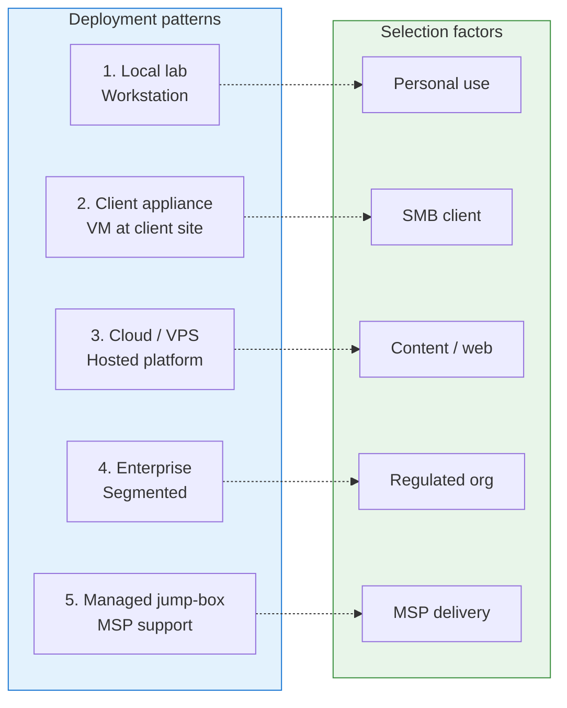

# Deployment pattern comparison

## Purpose

This diagram compares the five reference deployment patterns to help clients and delivery teams select the right starting point.

## Pattern comparison diagram

## Pattern comparison table

| Pattern | Best for | Always-on | Client data locality | Governance complexity |
|---|---|---|---|---|
| Local lab / workstation | Development, experiments, demos | No | Local | Low |
| Client appliance VM | SMB/MSP client delivery | Yes | On-site | Medium |
| Cloud / VPS hosted | Website/content, external integrations | Yes | Cloud | Medium |
| Enterprise segmented | Regulated, larger organisations | Yes | Per policy | High |
| Managed AI jump-box | MSP support, remote operations | Yes | On-site | Medium-High |
