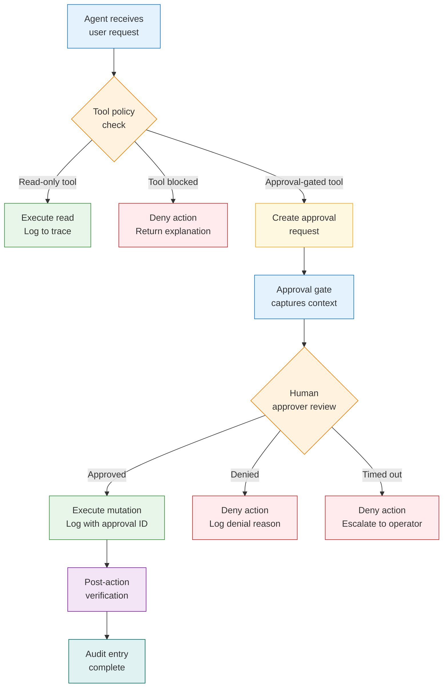

# Governance and approval flow diagram

## Purpose

This diagram shows how an action request flows through the governance and approval system before any mutation is performed.

## Approval flow diagram

## Approval gate data captured

Every approval gate should record:

- Requested action
- Reason for the request
- Affected system
- Risk level
- Expected change
- Rollback plan
- Operator approval status
- Timestamp and actor
