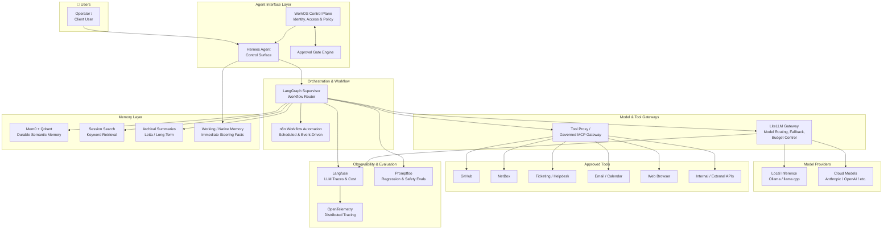
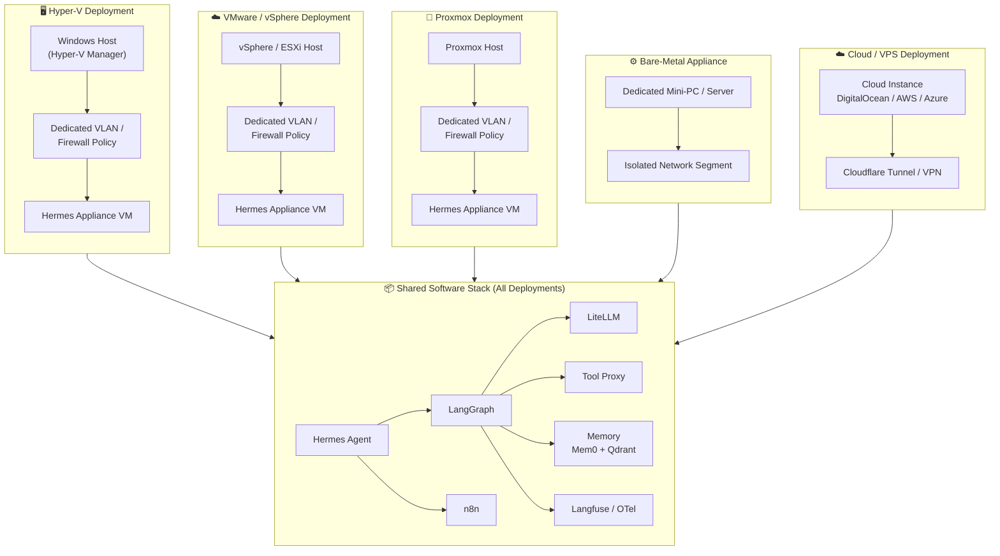
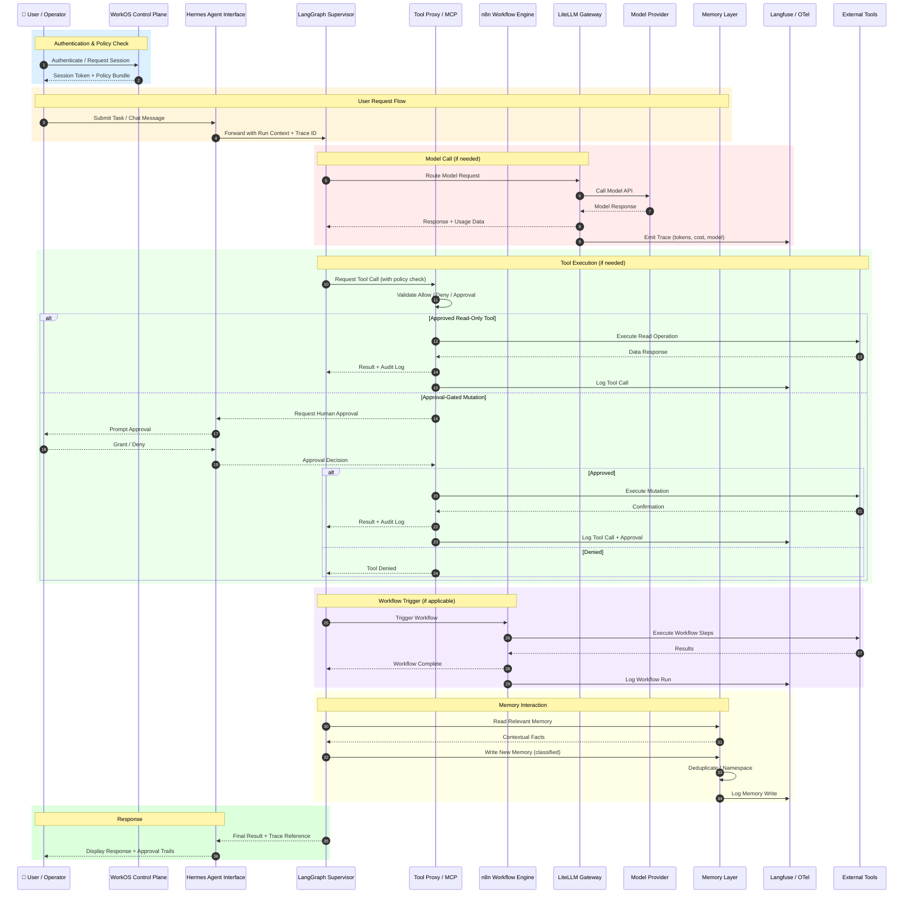
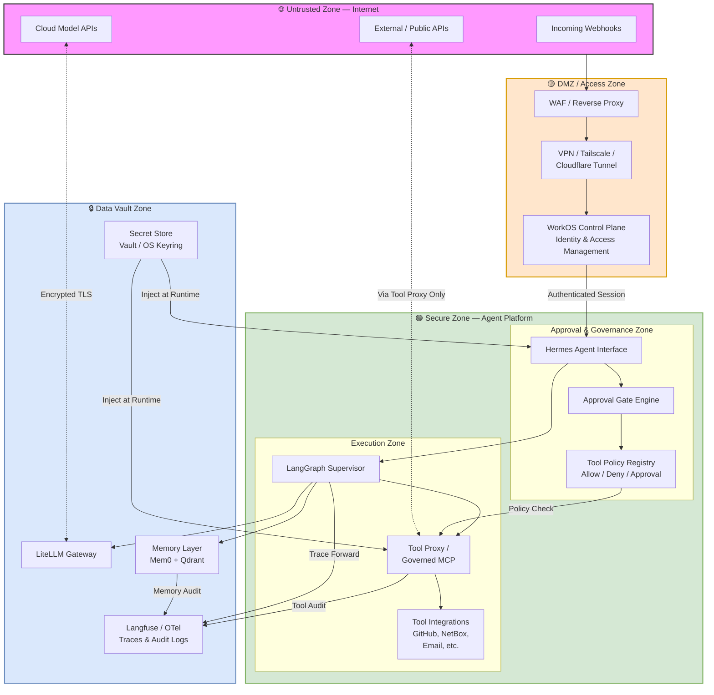
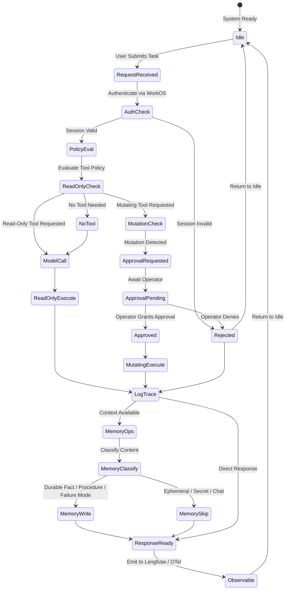

# Architecture Diagrams

This directory contains visual architecture diagrams for the Hermes Enterprise Reference Architecture. All diagrams are written in [Mermaid](https://mermaid.js.org/) format and render natively in GitHub Markdown.

## Diagram index

| # | Diagram | File | What it shows |
|---|---------|------|---------------|
| 1 | System Architecture | [`system-architecture.mmd`](#1-system-architecture) | Full platform component map — users, agents, orchestration, gateways, memory, tools, observability |
| 2 | Deployment Topology | [`deployment-topology.mmd`](#2-deployment-topology) | How the platform maps onto Hyper-V, VMware, Proxmox, bare-metal, and cloud VPS hosts |
| 3 | Data Flow | [`data-flow.mmd`](#3-data-flow) | End-to-end sequence of a user request through auth, model calls, tool execution, workflow triggers, and memory |
| 4 | Security Boundaries | [`security-boundaries.mmd`](#4-security-boundaries) | Trust zones — internet, DMZ, secure agent zone, data vault — and how traffic crosses boundaries |
| 5 | Governance & Approval Flow | [`governance-flow.mmd`](#5-governance--approval-flow) | State machine of an agent run from idle through auth, policy check, approval gates, mutation, and memory writes |

---

## 1. System Architecture



### How to read it

This is the top-level component map. Key points:

- **Users** interact only with the Hermes Agent interface and WorkOS control plane.
- **LangGraph** is the orchestration brain — every model call, tool call, and workflow trigger flows through it.
- **LiteLLM** abstracts all model providers (local and cloud) and captures cost/usage data.
- **Tool Proxy** is the single enforcement boundary — no tool call reaches an external system without passing through it.
- **Memory** is layered: working memory for immediate context, Mem0+Qdrant for durable facts, session search for historical retrieval, archival for long summaries.
- **Observability** (Langfuse + OpenTelemetry) traces every major action end to end.

---

## 2. Deployment Topology



### How to read it

All five deployment patterns run the **same software stack**. The difference is only the placement:

| Deployment | Best for |
|---|---|
| **Hyper-V** | SMB clients already running Windows Server |
| **VMware** | Regulated environments with existing vSphere estates |
| **Proxmox** | Cost-sensitive or open-source-first deployments |
| **Bare-metal** | Maximum performance, air-gapped options |
| **Cloud VPS** | Always-on webhooks, content workflows, public integrations |

Each deployment should use a dedicated VLAN or firewall policy to isolate agent traffic.

---

## 3. Data Flow



### How to read it

This sequence diagram traces one complete agentic run from start to finish:

1. **Authentication** — WorkOS validates the session and returns a policy bundle.
2. **Request intake** — The user's task enters through the Hermes interface and is forwarded to LangGraph with a trace ID.
3. **Model call** — LiteLLM routes to the appropriate model provider, captures usage data, and emits a trace to Langfuse.
4. **Tool execution** — The Tool Proxy enforces policy. Read-only tools execute immediately; mutations require explicit human approval.
5. **Workflow automation** — n8n runs scheduled or event-driven workflows, with every step logged.
6. **Memory operations** — Memory is read for context and written back after classification, deduplication, and namespacing.
7. **Response** — The final output returns to the user with full traceability.

---

## 4. Security Boundaries



### How to read it

This diagram shows four trust zones with enforced boundaries:

| Zone | Purpose | Access |
|---|---|---|
| **Internet** | Untrusted — webhooks, cloud APIs, public endpoints | No direct access to agent platform |
| **DMZ** | Access control — WAF, VPN tunnel, identity | Only authenticated sessions pass through |
| **Secure Zone** | Agent execution — orchestration, approval gates, tool policy | Internal only, policy-enforced |
| **Data Vault** | Sensitive data — secrets, memory, traces | Runtime injection only, never exposed |

Key principles:
- **No direct internet-to-agent path.** All traffic passes through the DMZ.
- **Secrets are injected at runtime** from a vault — they never appear in code, prompts, or logs.
- **External API calls** go exclusively through the Tool Proxy.
- **Audit logs** capture every cross-boundary event.

---

## 5. Governance & Approval Flow



### How to read it

This state machine shows the governance lifecycle of a single agent run:

1. **Authentication** — Every session must pass WorkOS identity check.
2. **Policy evaluation** — Each tool request is classified as read-only, mutating, or no-tool-needed.
3. **Approval gates** — Mutations require explicit operator approval before execution. Denied requests are logged and returned.
4. **Trace logging** — Every path (read, mutate, deny) produces a trace in Langfuse/OTel.
5. **Memory classification** — Content is classified before being written. Secrets and ephemeral chat are never persisted as durable memory.
6. **Observable by default** — Every run emits traces, making the full lifecycle auditable.

---

## Using these diagrams

### In GitHub

Copy any ` ```mermaid ` block into a Markdown file or issue comment — GitHub renders Mermaid natively.

### In documentation tools

- **Obsidian** — Mermaid is supported out of the box.
- **Notion** — Use a Mermaid embed block.
- **Confluence** — Use the Mermaid macro.
- **VS Code** — Install the "Markdown Preview Mermaid Support" extension.

### Exporting

To export as PNG/SVG, use any of:
- <https://mermaid.live> — paste the diagram source and export.
- The `mermaid-cli` (`@mermaid-js/mermaid-cli`) for local rendering.
- Most diagramming tools (draw.io, Lucidchart) support Mermaid import.

---

## Related documentation

- [Architecture overview](../architecture/overview.md) — detailed component descriptions
- [Deployment patterns](../deployment-patterns.md) — deployment pattern selection guide
- [Security and governance](../security-and-governance.md) — full governance model and autonomy levels
- [Memory, observability & evaluation](../memory-observability-evals.md) — memory model, tracing, and eval approach
- [Client appliance profiles](../client-appliance-profiles.md) — appliance profile definitions
- [Executive summary](../executive-summary.md) — non-technical overview for directors and prospects
