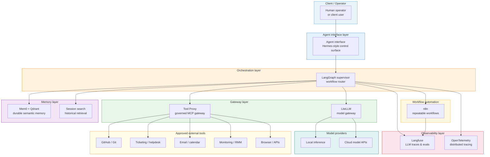

# Logical platform architecture

## Purpose

This diagram shows the logical layers of the Hermes Enterprise Reference Architecture and how they relate to each other. It is intended for both technical and non-technical audiences.

## Logical architecture diagram

## Layer summary

| Layer | Role |
|---|---|
| Client / Operator | The human who interacts with the platform |
| Agent interface | The main human-agent interaction surface |
| Orchestration | Routes tasks, preserves context, propagates trace IDs |
| Workflow automation | Scheduled and event-driven repeatable workflows |
| Tool gateway | Enforces deny-by-default policy, approval gates, audit |
| Model gateway | Routes model calls, captures cost, enables fallback |
| Memory | Durable recall with classification, dedupe, and review |
| Observability | Traces, debugging, cost tracking, eval context |
| Model providers | Local or cloud inference endpoints |
| External tools | GitHub, ticketing, email, monitoring, browser, APIs |
