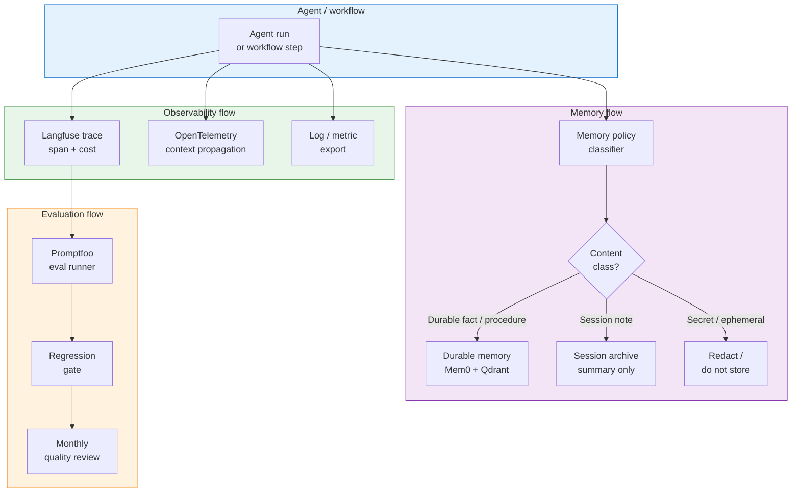
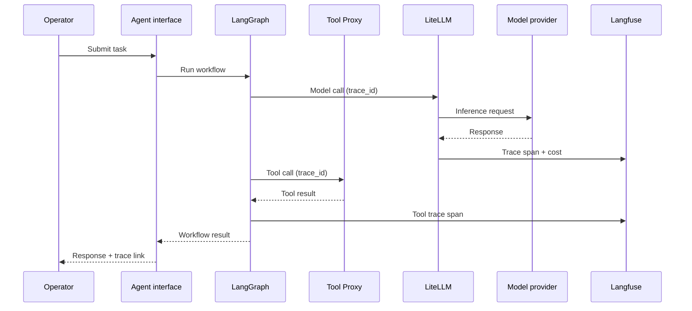

# Memory, observability, and evaluation flow

## Purpose

This diagram shows how memory reads/writes, observability traces, and evaluation signals flow through the platform.

## Memory, observability, and evaluation diagram

## Trace context propagation

